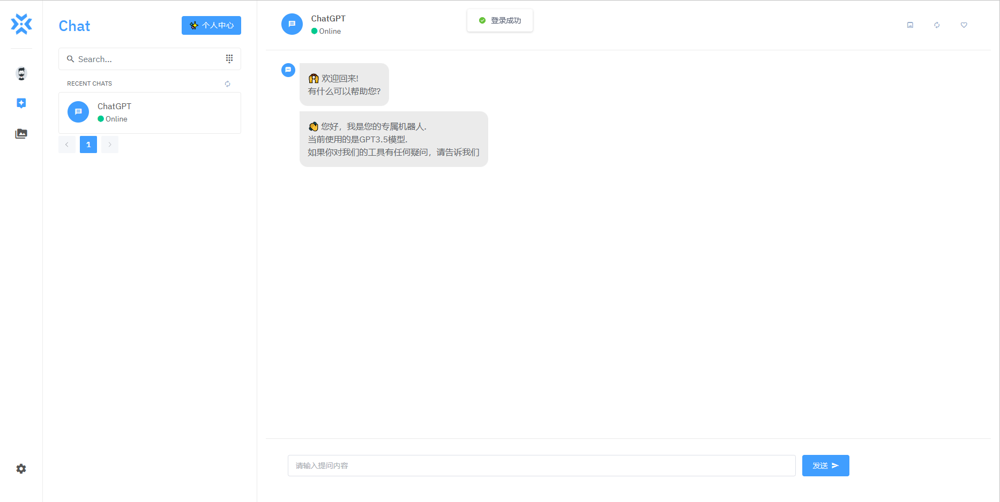
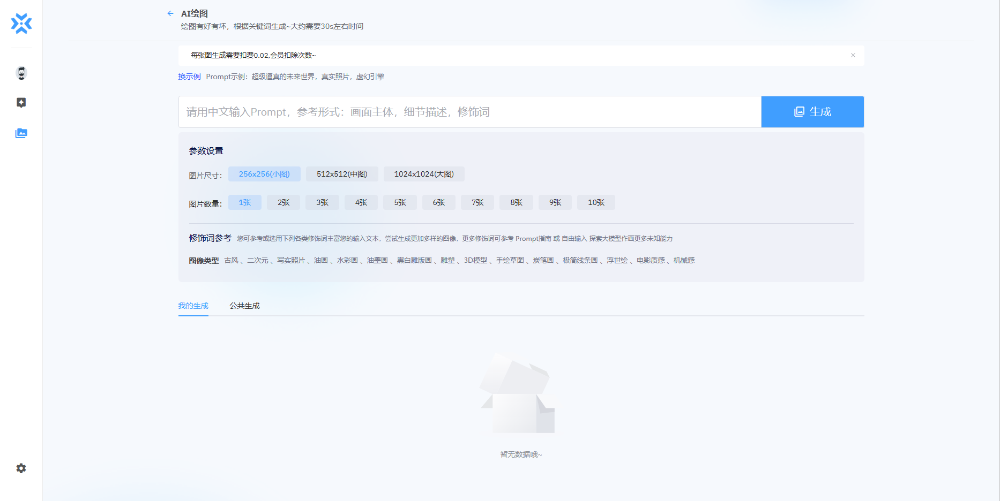
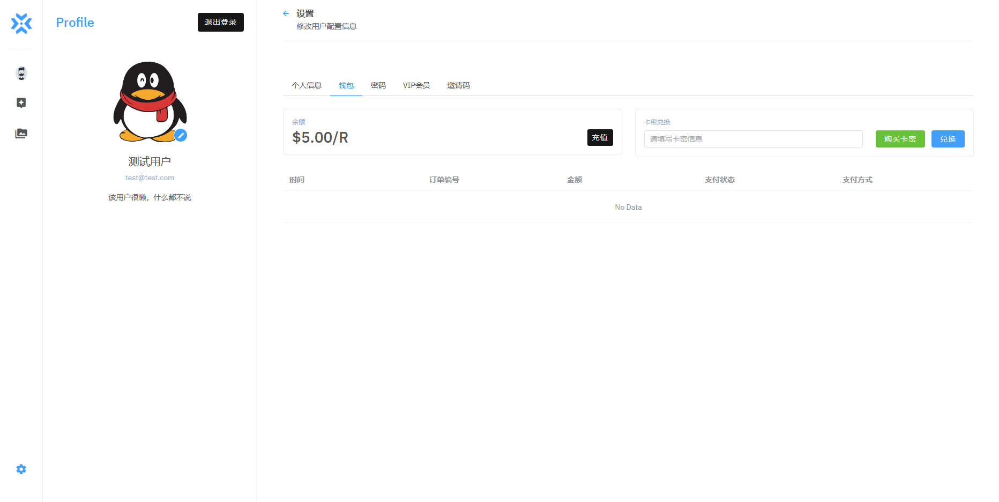
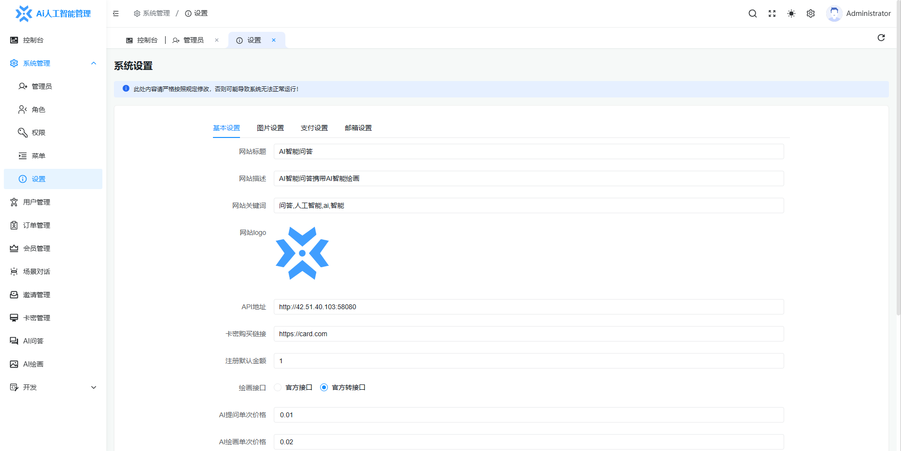
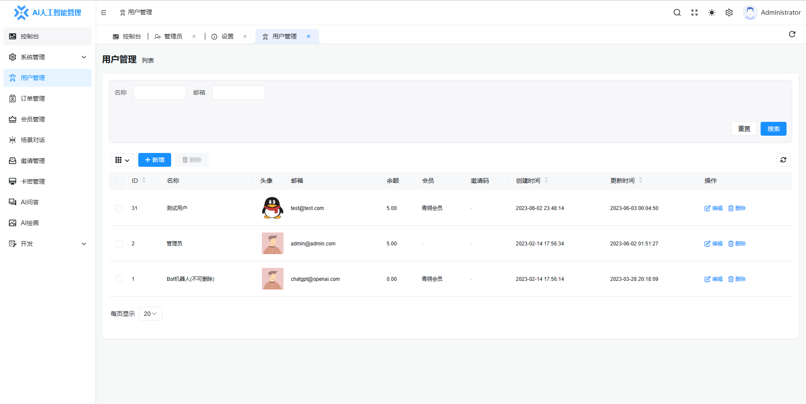

注: 本程序源码仅限个人或公司学习或自用，可以商用，但请勿用于非法用途。
如需完整商业版请联系QQ194088539

服务器环境: centos7/8 + php8.1 + mysql5.7 + redis + (nginx)

开发工具: idea + php8.1

ChatGPT Ai机器人 商业程序, 使用chatgpt官方3.5接口，可问答，可绘图，自带支付宝,微信,银联收款接口，自带阿里云OSS接口，可生成卡密，系统成熟无bug，可用于运营。

chatgpt官方账户可到淘宝去买，把密钥填入后台即可开箱即用。需要完整版请联系QQ:194088539

系统演示:

      用户端   http://42.51.40.103:58081/              用户名: test@test.com      密码: test998998

      管理端   http://42.51.40.103:58080/admin    用户名: admin                   密码: admin888